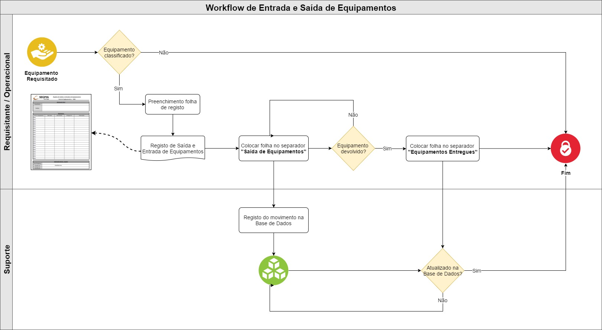

*********************
Gestão de Equipamentos
*********************

Esta secção pretende documentar o processo de gestão de equipamentos e respetiva sala de equipamentos.

Workflow Sala Equipamentos
==============================

Todo o movimento de equipamentos, da Sala de Equipamentos, deverá seguir o seguinte workflow procedimental, sendo registado sempre através da base de dados.

Base de Dados
==============================

Teste1

Registo novo equipamento
---------------------------

Teste1

Movimentação
---------------------------

Teste1

