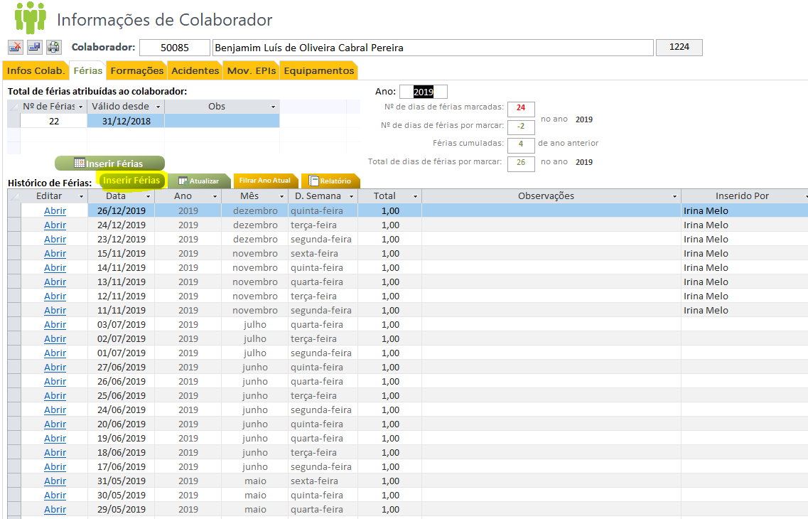

*********************
Gestão de Férias
*********************

Esta secção pretende documentar o processo da gestão de férias. 

Workflow Gestão Férias
==============================

O registo e autorização de férias, deverá seguir o seguinte workflow procedimental, sendo registado através da base de dados.

"em desenvolvimento..."	

Registo Férias
==============================

A seguinte secção pretende documentar o registo de férias na base de dados, existindo duas opções, através do painel do Colaborador ou através do painel administrativo. 

Colaborador
---------------------------

Para o registo de férias através do painel do Colaborador, deverá aceder ao separador :guilabel:`Colaboradores`, na base de dados de suporte, selecionar o colaborador e clicar no separador :guilabel:`Férias` sendo necessário o preenchimento do seguinte formulário:

.. Note:: Todas as férias incialmente introduzidas, por defeito, estão por validar pelo respetivo superior. 
			Caso o superior responsável, já tenha validado as férias, deverá ser selecionado "validado superior" na respetiva data. 
	
Listagem Geral
---------------------------

