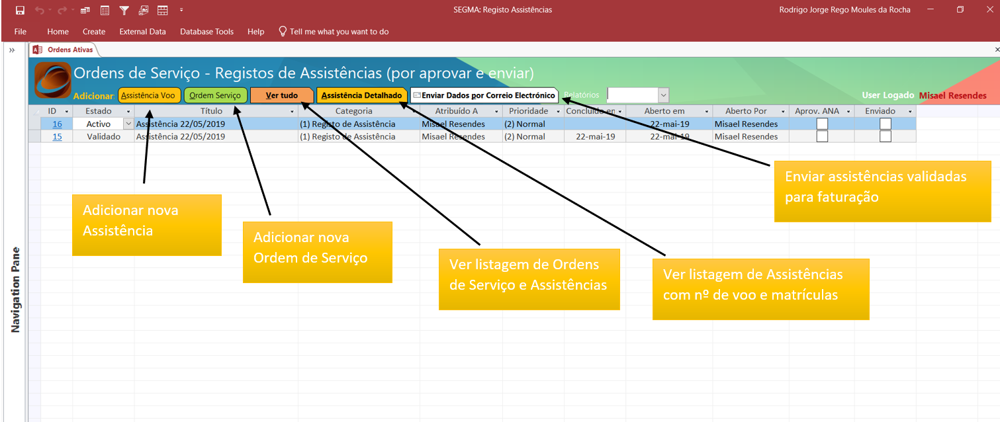
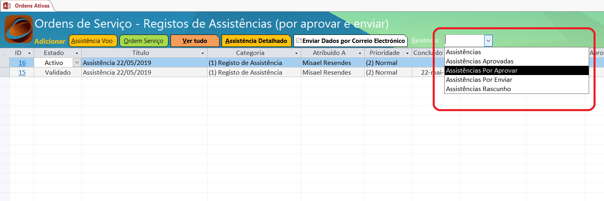
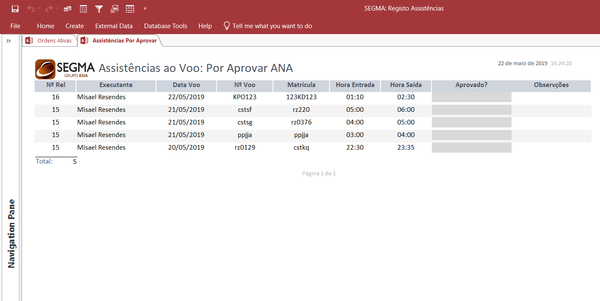
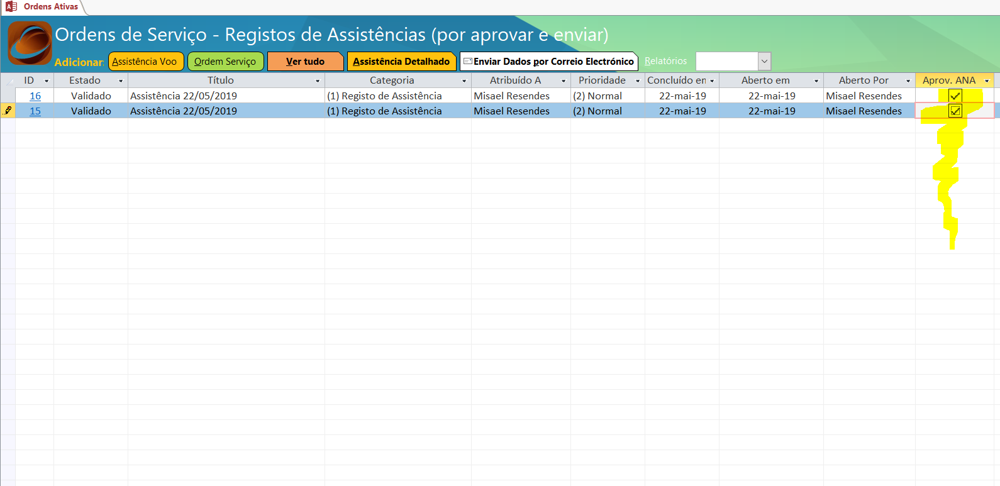
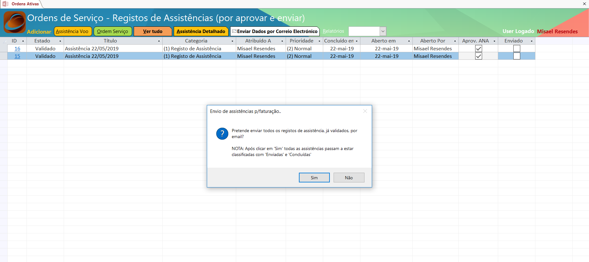

***************************************************
BD: ANA Santa Maria
***************************************************

Esta secção pretende documentar procedimentos e servir como manual para a base de dados 
utilizada para registo de ``Assistência ao voo`` e ``Ordens de Servoço`` no Aeroporto de Santa Maria.

Base de Dados
=====================================

Neste painel inicial têm a visualização geral de todas os Relatórios, relativos a Assistências, ativos. 

.. note:: Todos os registos que ainda não foram validados (pela ANA) e enviados para faturação, aparecem neste 1º ecrã. 

Procedimentos
=====================================

No fím de cada mês (entre dia 29 -30) deverá ser  enviado o mapa de assistências (registos por validar), através da base de dados.

.. important:: O registo apenas deverá ser validado na base de dados após assinatura pelo responsável da ANA. 

Assistências
=====================================

Workflow
-------------------------------------

.. image:: img/BD_ANA_Aeroportos/workflow.png

Registo de assistência 
-------------------------------------

Para registar uma assistência de voo deverá clicar no botão ``Assistência Voo`` e preencher o seguinte formulário:

.. important:: Os horários dos voos não se devem sobrepor! Isto é, se existirem 2 assistências entre as 01:00 e as 03:00, o registo deverá ser:

		- 1º Voo: das 01:00 até às 02:00;
		- 2º Voo: das 02:00 até às 03:00;
	Apesar do período temporal do voo ser entre as 01:00 e as 03:00.

Aprovar
-------------------------------------

No fím do mês, e após total registos de assistências, deverá ser impresso o documento para validação do responsável da ANA. 

O utilizador deverá selecionar o relatório ``Assistências por validar`` : 

Impresso o seguinte relatório e entregue ao responsável para validação/assinatura:

Após receção da folha validada pelo responsável, deverá validar manualmente na base de daos todos os relatórios.

Enviar p/ faturar
-------------------------------------

Após validação na base de dados basta selecionar o botão ´´Enviar dados por correio eletrónico´´ para a faturação da SEGMA: 

Ordens de Serviço
=====================================

Registar 
-------------------------------------

Concluír 
-------------------------------------

