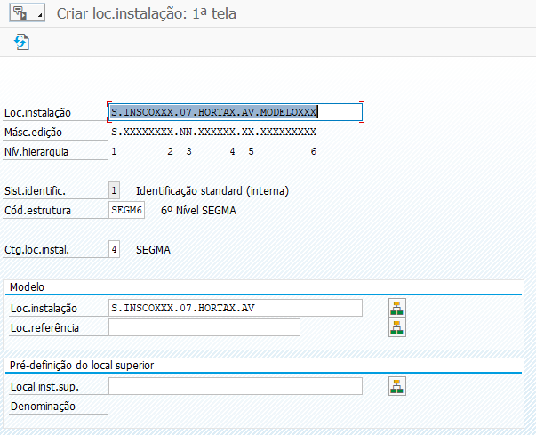
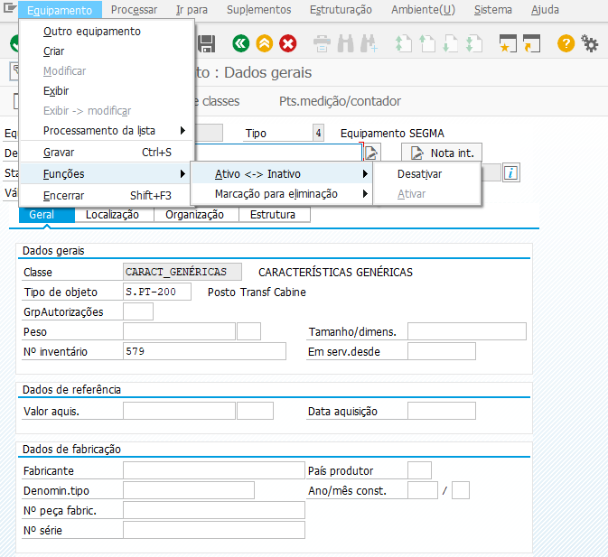

***************
Manutenção
***************

Esta secção pretende documentar o processo da gestão de manutenção, identificando 
também os respetivos procedimentos de criação e atualização de dados em SAP. 

Procedimentos
=====================================

Pretende-se nesta secção identificar procedimentos gerais, consoante o departamento.

AVAC 
-------------------------------------

.. Note:: Sempre que existir a necessidade de recolha de equipamentos, de um Cliente/Instalação, deverá ser utilizada a lista específicada em baixo! 

:download:`Lista Equipamentos.xls <files/Lista_Equipamentos.xlsx>`.

SAP: Manual
=====================================

Este tópico pretende explicar e documentar os procedimentos referente ao módulo de SAP:PM. 

Locais de Instalação
-------------------------------------

Um local de instalação representa uma estrutura organizacional hierárquica dentro da empresa, serve basicamente para estruturar os 
objectos de manutenção de uma empresa de acordo com critérios funcionais, relacionados com os diversos processos de manutenção. 
Um local de instalação representa o lugar em que trabalhos de manutenção são realizados.

Estrutura
^^^^^^^^^^^^^^^^^^^^^^^^^^^^^^^^^^

Gráficamente a estrutura implementada em SAP:PM é mostrada na seguinte imagem: 

.. image:: img/estruuta_PM.png

.. Attention:: É fundamental que a criação do local esteja correta, seguindo as instruções indicadas nos seguintes tópicos e com o número de carácteres. 

.. csv-table::
   :file: EstruturaPM.csv
   :header-rows: 1 
   :class: longtable
   :widths: 1 1 1

Criar Local de Instalação
^^^^^^^^^^^^^^^^^^^^^^^^^^^^^^^^^^

Para criar um novo local deverá aceder à transação ``IL01``, devendo preencher os seguintes campos, conforme demonstrado infra: 
 

.. Note:: A categoria do local deverá ser sempre ``4``.
.. Attention:: O código de estrutura deverá respeitar os níveis indicados na tabela anterior.
.. Hint:: 	Depois de criado o primeiro registo, caso queira copiar automáticamente as informações (PEP, Ilha, Área Operacional, etc..) 
			basta inserir o último local criado no campo ``modelo``.

No separador :guilabel:`Localização` deverá ser preenchidos os seguintes campos: 

No separador :guilabel:`Organização` deverá ser preenchidos os seguintes campos: 

No separador :guilabel:`Estrutura` deverá ser preenchidos os seguintes campos: 

.. Attention:: Qualquer local, ou equipamento, deve estar montado. Ou seja, o local de instalação superior deverá esta preenchido. 

Procedimento: Desginações 
^^^^^^^^^^^^^^^^^^^^^^^^^^^^^^^^^^

Todos os locais de instalação, após o 4º nível deverão ter a seguinte estrutura de desginação: 

Estrutura: ``Especialidade | Denominação do local``

Exemplo: ``UPS | Continente da Horta``

.. Attention: No caso do equipamento ser do tipo PT, o 4º nível deverá também contar a definição "PT |" antes da denominação do local de instalação. 

Procedimento: PT's
^^^^^^^^^^^^^^^^^^^^^^^^^^^^^^^^^^

No caso particular dos Postos de Transformação, o 4º nível deverá ser o local do posto de transformação, identificando a ilha e código do PT na estrutura do local, como por exemplo: 

Equipamentos
-------------------------------------

Um equipamento é um objecto técnico de manutenção, físico e individual cuja manutenção é gerida no sistema SAP. 
Um equipamento representa uma máquina passível de efectuar manutenção de forma independente. 

Os equipamentos poderão ser montados e desmontados nos locais de instalação sempre haja uma alteração da localização do equipamento havendo 
sempre um registo histórico dos dados.

Criar equipamento
^^^^^^^^^^^^^^^^^^^^^^^^^^^^^^^^^^

Para criar um novo local deverá aceder à transação ``IE01``, devendo preencher os seguintes campos, conforme demonstrado infra: 

.. image::  img/equipamento.PNG

.. Note:: A categoria do local deverá ser sempre ``4``.

No separador :guilabel:`Geral` deverá ser preenchidos os seguintes campos: 

.. Attention:: Deverá selecionar o tipo de objeto correto, é através desta informação que os modelos em NAVIA estão associados (i.e.: S.PT-200 = Manutenção Posto de Transformação).

No separador :guilabel:`Localização` deverá ser preenchidos os seguintes campos: 

No separador :guilabel:`Organização` deverá ser preenchidos os seguintes campos: 

No separador :guilabel:`Estrutura` deverá ser preenchidos os seguintes campos: 

.. Attention:: Qualquer local, ou equipamento, deve estar montado. Ou seja, o local de instalação superior deverá esta preenchido. 

Desativar/Eliminar equipamento 
^^^^^^^^^^^^^^^^^^^^^^^^^^^^^^^^^^

Para inativar um equipamento deverão ser feitos os seguintes passos, através da transação ``IE02``:
	- 'Equipamento' > 'Funções' > 'Ativo<->Inativo' > 'Desativar'
	- 'Equipamento' > 'Funções' > 'Marcação para eliminação' > 'Definir'
	- Guardar
	

Adicionar Dados Técnicos
^^^^^^^^^^^^^^^^^^^^^^^^^^^^^^^^^^

Sempre que for necessário adicionar dados técnicos (modelo, marca, etc.) a um equipamento, deverá ser à :guilabel:`Síntese de classes` e adicionar a classe específica: 

As classes disponíveis para os equipamentos SEGMA, são as seguintes: 

Adicionar Contatos
-------------------------------------

Criar novo Contacto
^^^^^^^^^^^^^^^^^^^^^^^^^^^^^^^^^^

Para adicionar um novo contato é necessário aceder à transação ``VAP1`` e selecionar o cliente ao qual o contato estará associado. 

No separador :guilabel:`Endereço Comercial` deverá ser preenchida a restante informação, conforme infra: 

Associar Contacto
^^^^^^^^^^^^^^^^^^^^^^^^^^^^^^^^^^

Para associar um contato a um Local de Instalação ou Equipamento, deverá aceder ao respetivo objeto e adicionar o contato no formulário ``Parceiro``, procurando primeiro 
pelo cliente e depois pela pessoa de contato.

Transações Frequentes
-------------------------------------

.. csv-table::
   :file: Transat.csv
   :header-rows: 1 
   :class: longtable
   :widths: 1 1
  
