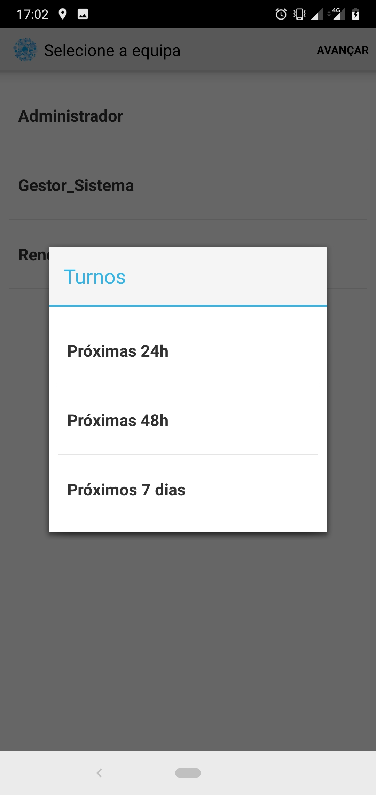
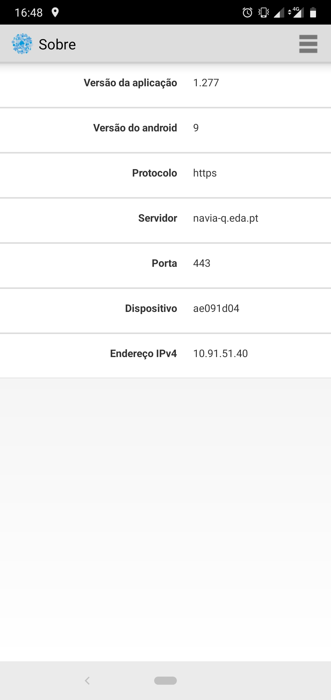
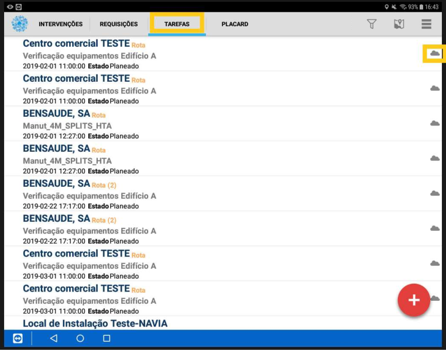
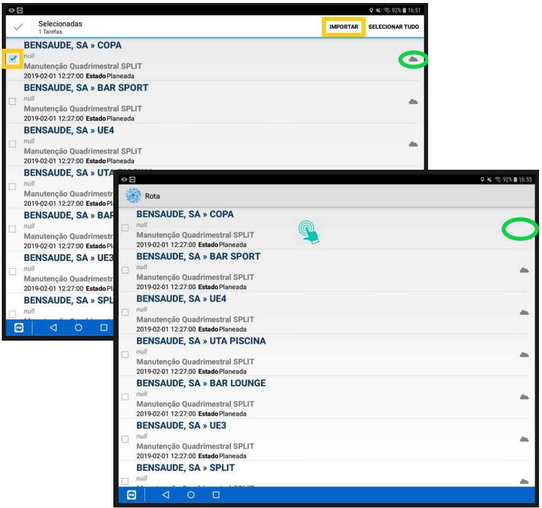
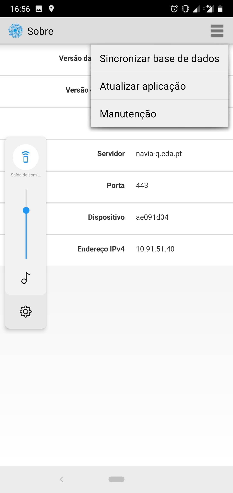

***************
NAVIA
***************

Esta secção pretende documentar, de uma forma geral, todos os passos documentados na aplicação NAVIA, de apoio à gestão operacional.

Mobilidade
============================

Login
-------------------------------------

O acesso do utilizador à aplicação é efetuado da mesma forma que o acesso em servidor. Cada utilizador
devidamente criado terá um Username e Password, através dos quais poderá aceder à sua área de
trabalho. A Figura 3 demonstra a interface de entrada na aplicação de mobilidade NAVIA.

Seleção turno
-------------------------------------

Após efetuar o login, o utilizador poderá ter que selecionar a equipa em que pretende entrar (caso
pertença a mais do que uma equipa), e o turno que pretende visualizar, podendo ver os trabalhos
agendados para diferentes espaços temporais, até 7 dias de distância.

Definições Mobilidade
-------------------------------------

Para poder executar a aplicação no dispositivo móvel, é necessário a configuração das seguintes definições:

Tarefas
-------------------------------------

O conceito de tarefas representa os trabalhos efetuados no terreno de modo preventivo pelas várias
equipas de trabalho. 

O processo de registo de uma tarefa é efetuado em 3 passos: importação, registo e exportação. Estes
são descritos de seguida

Importação
^^^^^^^^^^^^^^^^^^^^^^^^^^^^^^^^^^

O ícone nuvem indica que a tarefa ainda não foi importada e, desta forma, o registo não pode ser
iniciado. Para importar uma tarefa, basta selecionar na caixa do lado esquerdo do ecrã na linha da
tarefa que pretendemos executar, e premir o botão importar.

Após a importação da tarefa, seleciona-se a mesma para iniciar o registo das variáveis

Forçar atualização aplicação
-------------------------------------

Quando são disponibilizadas atualizações, ao iniciar, a aplicação atualiza automaticamente.

Se por algum motivo, a atualização não for concluída, existe ainda a possibilidade de forçar essa atualização. 
Para tal, clicar em ``Sobre`` e no ícone de opções no canto superior direito selecionar Atualizar aplicação.

