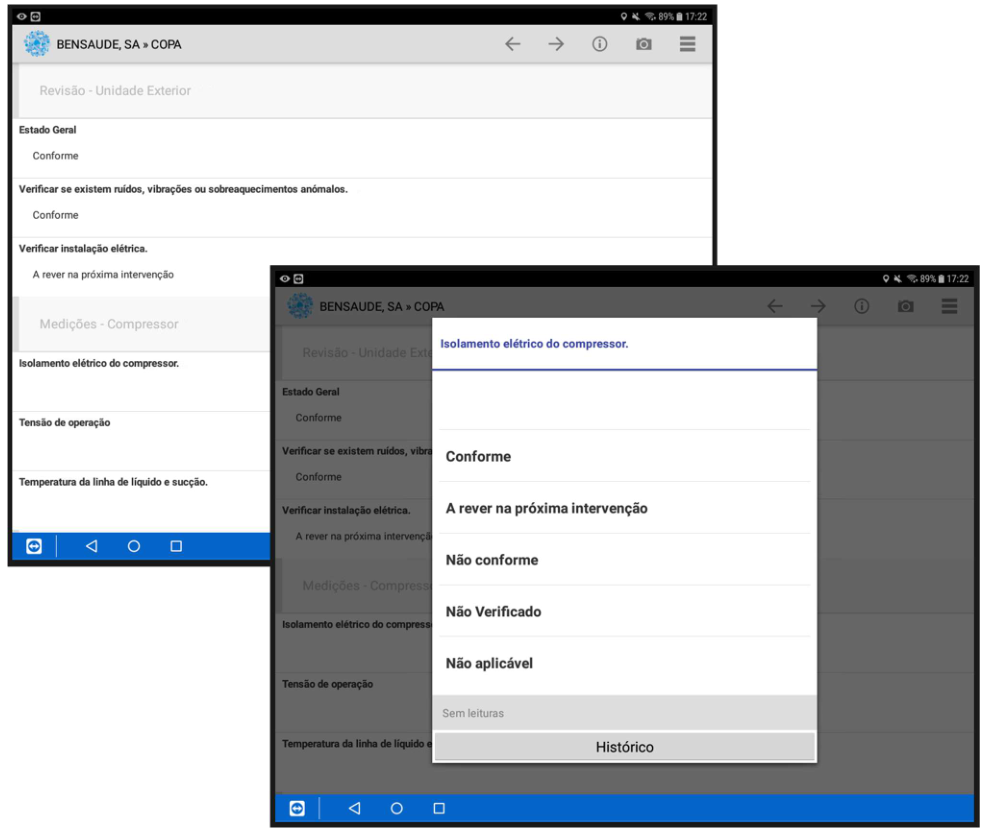
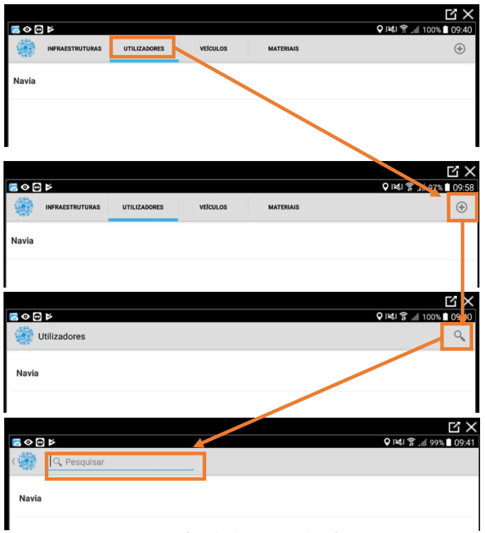
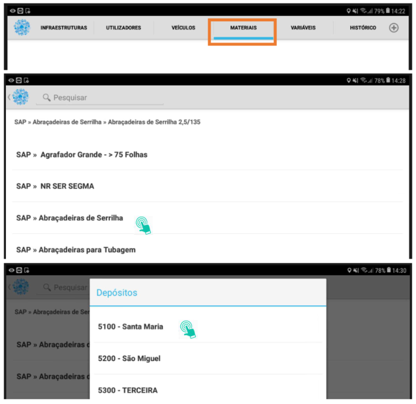
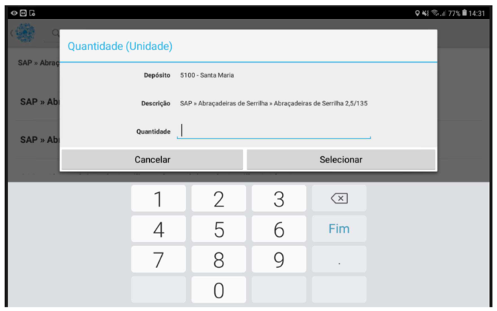
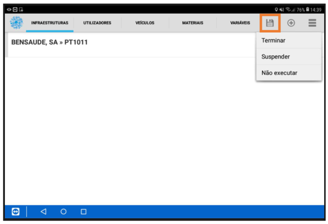
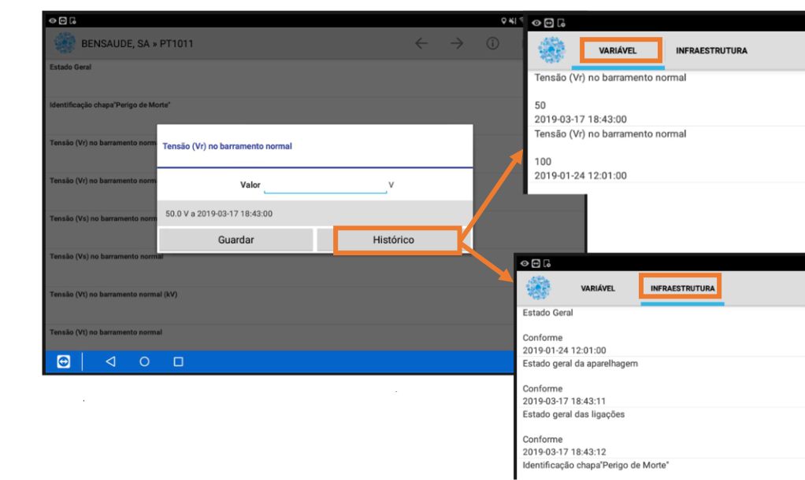
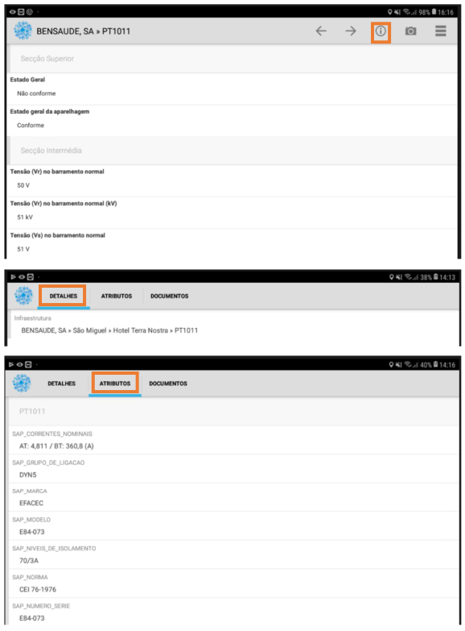
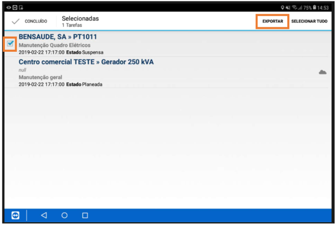

***************
NAVIA
***************

Esta secção pretende documentar, de uma forma geral, todos os passos documentados na aplicação NAVIA, de apoio à gestão operacional.

Mobilidade
============================

Login
-------------------------------------

O acesso do utilizador à aplicação é efetuado da mesma forma que o acesso em servidor. Cada utilizador
devidamente criado terá um Username e Password, através dos quais poderá aceder à sua área de
trabalho. A Figura 3 demonstra a interface de entrada na aplicação de mobilidade NAVIA.

Seleção turno
-------------------------------------

Após efetuar o login, o utilizador poderá ter que selecionar a equipa em que pretende entrar (caso
pertença a mais do que uma equipa), e o turno que pretende visualizar, podendo ver os trabalhos
agendados para diferentes espaços temporais, até 7 dias de distância.

.. image:: img/navia/turno.jpg

Definições Mobilidade
-------------------------------------

Para poder executar a aplicação no dispositivo móvel, é necessário a configuração das seguintes definições:

.. image:: img/navia/definicoes.jpg

Tarefas
-------------------------------------

O conceito de tarefas representa os trabalhos efetuados no terreno de modo preventivo pelas várias
equipas de trabalho. 

O processo de registo de uma tarefa é efetuado em 3 passos: importação, registo e exportação. Estes
são descritos de seguida

Importação
^^^^^^^^^^^^^^^^^^^^^^^^^^^^^^^^^^

.. image:: img/navia/tarefa_cloud.PNG

O ícone nuvem indica que a tarefa ainda não foi importada e, desta forma, o registo não pode ser
iniciado. Para importar uma tarefa, basta selecionar na caixa do lado esquerdo do ecrã na linha da
tarefa que pretendemos executar, e premir o botão importar.

Após a importação da tarefa, seleciona-se a mesma para iniciar o registo das variáveis

.. image:: img/navia/tarefa_importar.PNG

Registo
^^^^^^^^^^^^^^^^^^^^^^^^^^^^^^^^^^

Cada vez que é registada uma variável, o sistema avança automaticamente para a variável seguinte. Caso
se pretenda corrigir/alterar um determinado registo/valor, apenas é necessário premir novamente a
variável a corrigir. Feito isto, se não pretender alterar mais registos pode selecionar a opção “voltar”
(disponível no equipamento) para fechar o formulário.

No registo de uma tarefa, é importante identificar todos os elementos da equipa presentes na execução
da mesma. O utilizador que iniciou sessão no tablet fica, automaticamente, definido. Os restantes,
devem ser adicionados através do tab “Utilizadores”.

A associação de materiais a uma determinada tarefa é efetuada na Tab “Materiais”, da seguinte forma:

Após registar a tarefa respetiva, o utilizador tem 3 opções distintas:
	- Terminar: quando a tarefa se encontra concluída;
	- Suspender: quando a tarefa ainda não está concluída, e pretende-se continuar mais tarde ou passar para outra equipa;
	- Não executar: quando, por qualquer motivo, não é possível executar a tarefa.

Consulta Histórico Instalação
^^^^^^^^^^^^^^^^^^^^^^^^^^^^^^^^^^

Em “Histórico” podem consultar-se os registos anteriores relativos a essa variável, nomeadamente os
valores registados e as variáveis registadas na infraestrutura em questão.

Na interface de registo, através do ícone "i", é possível consultar alguns detalhes relativos à
infraestrutura, nomeadamente, o nome completo da organização em árvore, os atributos definidos e os
documentos.

Exportação
^^^^^^^^^^^^^^^^^^^^^^^^^^^^^^^^^^

Terminado o registo, é necessário realizar a exportação da(s) tarefa(s) registada(s), sendo estas
novamente enviadas para o servidor e disponibilizadas para consulta.
No final de cada turno, devem certificar-se de que todas as tarefas registadas foram efetivamente
exportadas.

Forçar atualização aplicação
-------------------------------------

Quando são disponibilizadas atualizações, ao iniciar, a aplicação atualiza automaticamente.

Se por algum motivo, a atualização não for concluída, existe ainda a possibilidade de forçar essa atualização. 
Para tal, clicar em ``Sobre`` e no ícone de opções no canto superior direito selecionar Atualizar aplicação.

.. image:: img/navia/basedados.jpg

