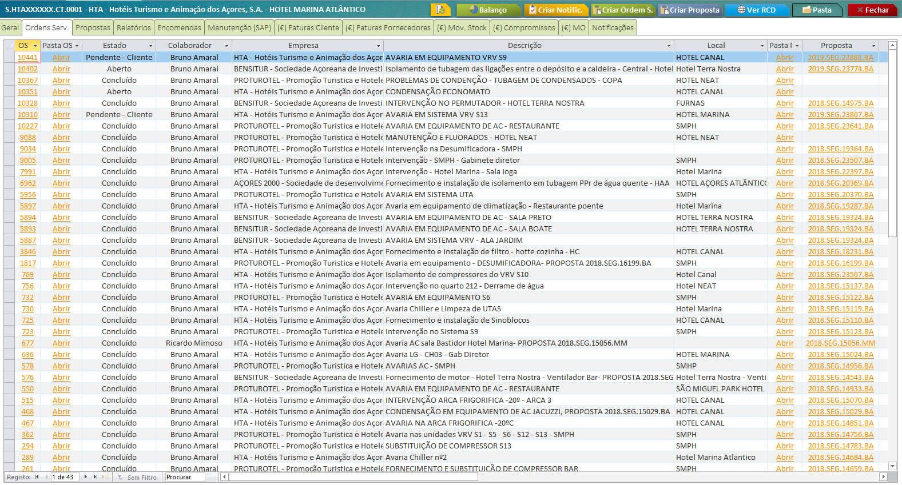
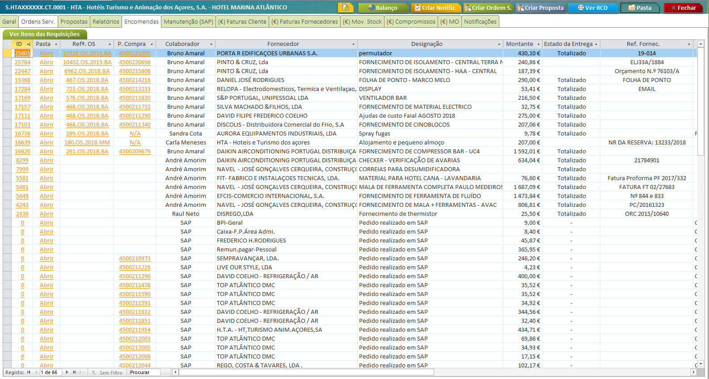
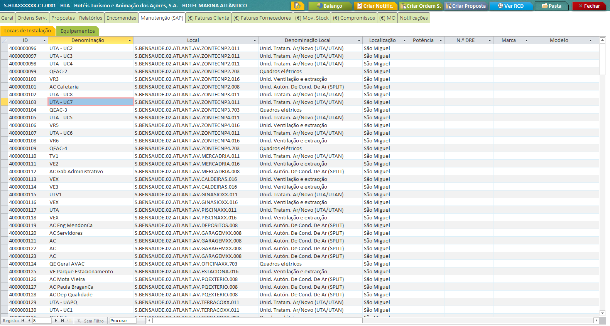

***************
Obras/Contratos
***************

.. contents:: Tabela de Conteudos

Esta secção têm como objetivo explicar o formulário de Obras/Contratos da base de dados, bem como informar acerca das suas funcionalidades.

Formulário Obra
===========================

O formulário da Obra/Contrato agrega toda a informação que seja imputada a um registo, seja hiperligações para pastas, RCD ou criação de Propostas e/ou Ordens de Serviço. 

.. image:: img/frm_obra.PNG

.. Note:: A partir da versão 7.00 da base de dados técnica, tornou-se possível a criação de um registo de Obra por qualquer utilizador. 

.. Important:: Todo o registo de Obra/Contrato está diretamente associado com um registo em SAP, para alocação de custos e proveitos. 

				A criação do registo em SAP é da responsabilidade do departamento de Suporte. Até criação do registo em SAP, a obra ficará temporariamente identificada como ´´Por Classificar´´. 

Ordens Serviço
===========================

Através do separador ´´Ordens Serv.´´ é possível visualizar todas as OS's associadas a este registo.

.. image:: img/frm_obra_OS.PNG

Propostas
===========================

Através do separador ´´Propostas´´ é possível visualizar todas as Propostas associadas a este registo, sejam através do intermédio de uma Ordem de Serviço ou selecão do registo diretamente na Proposta. 

Relatórios
===========================

Através do separador ´´Relatórios´´ é possível visualizar todas os relatórios técnicos associados a este registo, que tenham sido realizados na base de dados.

.. image:: img/frm_obra_relatorios.PNG

Encomendas
===========================

Através do separador ´´Encomendas´´ é possível visualizar todas as encomendas efetuadas para este registo, sejam através de SAP ou Access.

.. Note:: Qualquer encomenda que seja efetuada para a Obra, a mesma estará vísivel neste separador, independentemente de ter sido criada em Access ou SAP. 

		Se clicar na coluna "P. Compra" poderá consultar todos os itens encomendados de forma discriminada. 

.. Important:: A atualização de todos os registos de SAP para Acccess é realizado de forma manual e tipicamente no final de cada dia útil.

Manutenção (SAP)
===========================

Neste separador poderá consultar todos os registos existentes em SAP, associados ao Contrato. 

.. Important:: Qualquer alteração necessária terá de ser efetuada exclusivamente em SAP. 

Resultados Finançeiros
===========================

Esta secção pretende explicar como é consultada toda a informação relativa com custos e proveitos da Obra/Contrato.

Faturas Clientes
-----------------------

Faturas Fornecedores
-----------------------

Movimentos Stock
-----------------------

Mão de Obra
-----------------------
