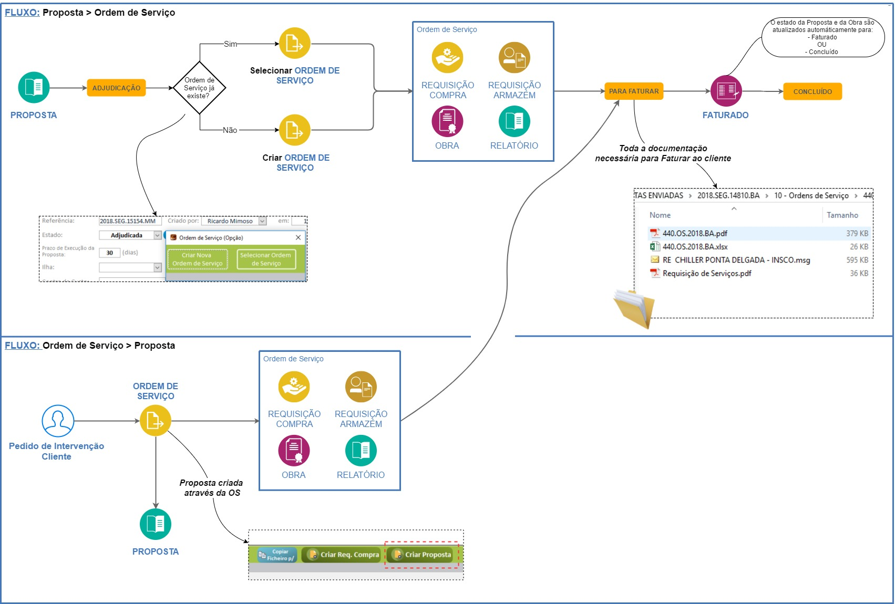
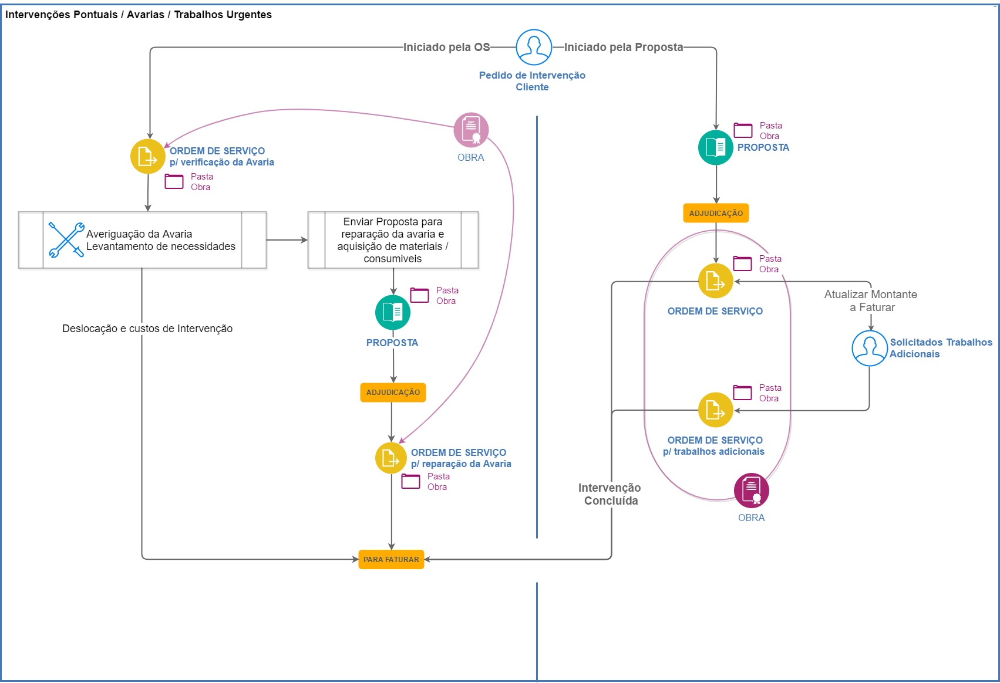
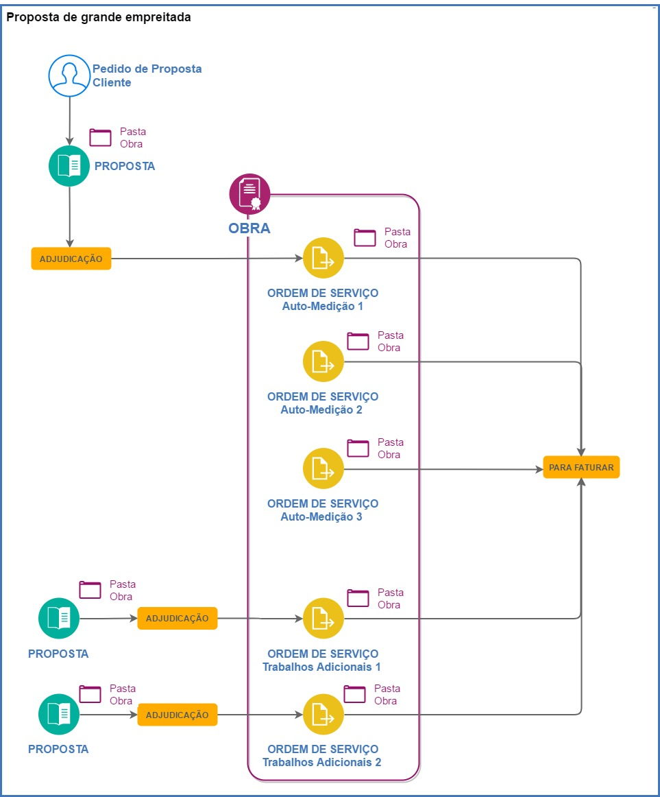

***************************************************
Sistemas Deteção Intrusão/Videovigilância
***************************************************

.. contents:: Tabela de Conteúdos

Objetivo
=================================

Esta seção têm como principal objetivo documentar o procedimento para instalação de sistemas de deteção de intrusão e/ou videovigiliância e uma seção de perguntas e respostas. 

FAQS 
=================================

Em desenvolvimento...

Worklow - Comunicação de registo
=================================

Associar OS
============================

Em desenvolvimento...

Casos Práticos Ordens Serv.
============================

Intervenções Pontuais / Avarias
-------------------------------------

O seguinte worflow demonstra duas alternativas, a primeira através da execução de um trabalho (tipicamente uma avaria) diretamente através da criação de uma OS, enquanto que o outro apenas é executado após adjudicação de um Proposta, com a possibilidade de criação de uma 2ª OS para faturação de trabalhos adicionais.

Faturação c/ autos de medição 
-------------------------------------

