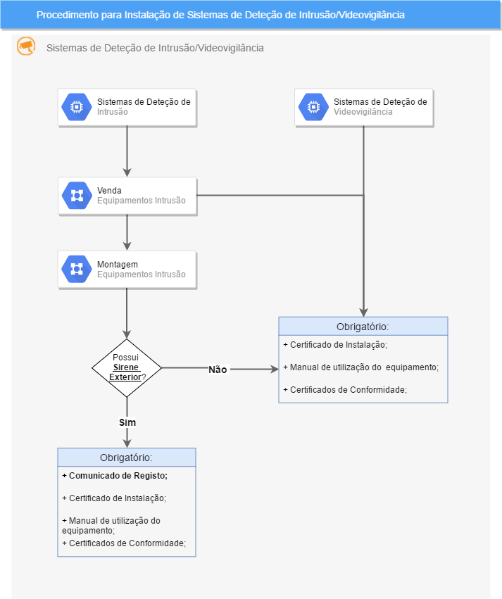

***************************************************
Sistemas Deteção Intrusão/Videovigilância
***************************************************

.. contents:: Tabela de Conteúdos

Objetivo
=================================

Esta seção têm como principal objetivo documentar o procedimento para instalação de sistemas de deteção de intrusão e/ou videovigiliância e uma seção de perguntas e respostas. 

Procedimento de Registo
=================================

Perguntas mais frequentes
=================================

Em desenvolvimento...

Legislação
============================

Nas próximas seções encontra-se a legislação a ter em conhecimento. 

Lei 34/2013 - Estabelece o regime de exerc. da actividade de segurança
--------------------------------------------------------------------------

  .. note:: Lei 34/2013 - Estabelece o regime do exercício da atividade de segurança privada e procede à primeira alteração à Lei n.º 49/2008, de 27 de agosto (Lei de Organização da Investigação Criminal)

Artigo 11.º - Instalação de dispositivos de alarme com sirene
~~~~~~~~~~~~~~~~~~~~~~~~~~~~~~~~~~~~~~~~~~~~~~~~~~~~~~~~~~~~~~~~~~

1. A instalação de dispositivos de alarme em imóvel que possua sirene exterior ou equipamento de comunicação suscetível de desencadear uma chamada para o número nacional de emergência ou das forças de segurança está sujeita a comunicação e registo na autoridade policial da área, no prazo de cinco dias úteis posteriores à sua montagem.
2. A comunicação a que se refere o número anterior é efetuada pelo proprietário ou utilizador do alarme e contém o nome, a morada e o contacto das pessoas ou serviços que, permanentemente ou por escala, podem em qualquer momento desligar o aparelho que haja sido acionado.
3. O proprietário ou utilizador do alarme assegura que o próprio ou as pessoas ou serviços referidos no número anterior, no prazo de três horas, contadas a partir da comunicação da autoridade policial competente, comparece no local e procede à reposição do alarme.
4. Os requisitos técnicos dos equipamentos, condições de funcionamento e modelo de comunicação a que se refere o n.º 2 são aprovados por portaria do membro do Governo responsável pela área da administração interna.

Artigo 12.º - Empresas de segurança privada
~~~~~~~~~~~~~~~~~~~~~~~~~~~~~~~~~~~~~~~~~~~~~~~~~~~~~~~~~~~~~~~~~~

2.  Não são consideradas empresas de segurança privada as pessoas, singulares ou coletivas, cujo objeto seja a prestação de serviços a terceiros de conceção, de venda, de instalação, de manutenção ou de assistência técnica de material e equipamento de segurança ou de centrais de alarme.
3.  Sem prejuízo do disposto no número anterior, as entidades que procedam ao estudo e conceção, instalação, manutenção ou assistência técnica de material e equipamento de segurança ou de centrais de alarme são obrigadas a registo prévio na Direção Nacional da Polícia de Segurança Pública (PSP).

Portaria n.º 273-2013 - Regulas as condições de prestação de seg. privada
--------------------------------------------------------------------------

	.. note:: Portaria n.º 273-2013- Regula as condições específicas da prestação dos serviços de segurança privada, o modelo de cartão profissional e os procedimentos para a sua emissão e os requisitos técnicos dos equipamentos, funcionamento e modelo de comunicação de alarmes

	..Important: Capítulo X - Instalação de dispositivos de alarme e de segurança 
				 Secção I - Comunicação, registo e condições de funcionamento 

Artigo 106.º - Comunicação e registo
~~~~~~~~~~~~~~~~~~~~~~~~~~~~~~~~~~~~~~~~~~~~~~~~~~~~~~~~~~~~~~~~~~

1.  A comunicação prevista no n.º 1 do artigo 11.º da Lei n.º 34/2013, de 16 de maio, é efetuada pelo proprietário ou utilizador do alarme, mediante impresso de modelo próprio, que constitui o anexo VII à presente portaria, dela fazendo parte integrante, sendo disponibilizado gratuitamente nas páginas oficiais das forças de segurança. 
2.  A comunicação prevista no número anterior poderá ser submetida por via eletrónica, desde que garantida a autenticação dos utilizadores através de certificados digitais, designadamente através do cartão do cidadão.
3. A comunicação a que se refere o n.º 1 deve conter obrigatoriamente os dados de identificação, morada e contatos telefónicos das pessoas ou serviços que, permanentemente ou por escala, podem em qualquer momento desligar o aparelho quando em alarme.

Artigo 107.º - Requisitos técnicos dos equipamentos
~~~~~~~~~~~~~~~~~~~~~~~~~~~~~~~~~~~~~~~~~~~~~~~~~~~~~~~~~~~~~~~~~~

1. São aplicáveis aos equipamentos de alarme os requisitos técnicos previstos na presente portaria.
2. O instalador autorizado de material e equipamento de segurança deve emitir um certificado de instalação garantindo a
conformidade com as normas referidas no número anterior.
3. Todas as intervenções de manutenção e assistência técnica de material e equipamento de segurança devem ser
anotadas no livro de registos relativo ao sistema instalado.

	..Important: Secção II - Requisitos técnicos aplicáveis a sistemas de segurança

Artigo 111.º - Graus de segurança dos sistemas de alarme
~~~~~~~~~~~~~~~~~~~~~~~~~~~~~~~~~~~~~~~~~~~~~~~~~~~~~~~~~~~~~~~~~~

Artigo 113.º - Certificado de instalação
~~~~~~~~~~~~~~~~~~~~~~~~~~~~~~~~~~~~~~~~~~~~~~~~~~~~~~~~~~~~~~~~~~

